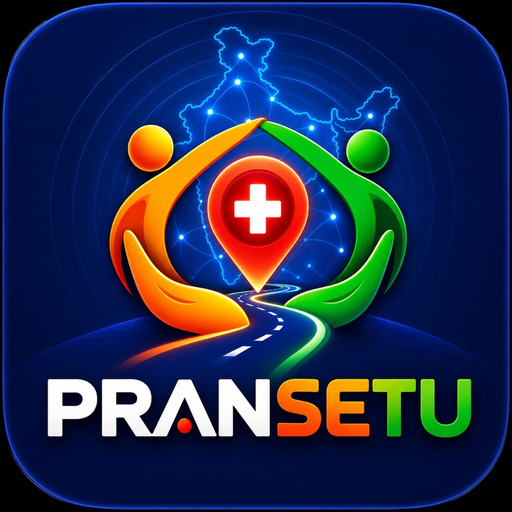

<p align="center">
  
</p>

<h1 align="center">PRANSETU (ପ୍ରାଣସେତୁ)</h1>

<p align="center">
  <strong>Resilient Emergency Communication & Zero-Cellular Disaster Mesh Network</strong><br>
  <em>Bridging every life to help, even when networks fail.</em>
</p>

<p align="center">
  <a href="apk/PRANSETU-latest.apk">
    
  </a>
</p>

---

PRANSETU is an Odisha-first, India-scalable disaster-management platform designed to preserve citizen-to-government communication and family safety circles when conventional cellular and internet connectivity are degraded.

## 📱 Android Citizen App Architecture

- **Zero-Delay Emergency SOS**: Instantaneous emergency trigger with breathing tactical halo animation and tactile haptic impulse.
- **Family Check-In Circle**: One-touch *"I AM SAFE"* beacon broadcasting across zero-cellular peer-to-peer mesh and direct SMS, with live hardware battery telemetry.
- **Offline Shelter Compass HUD**: Real-time 360° graduation ring and azimuth vector guiding survivors to nearby cyclone centers without data connection.
- **Real-Time Barometer Sensor**: Live atmospheric pressure telemetry (`hPa`) for immediate cyclone drop monitoring.
- **Store-and-Forward Mesh Relay**: Hop-limited, TTL-bounded opportunistic relay across nearby Android devices.
- **Multilingual Support**: First-class support for English, Odia (ଓଡ଼ିଆ), and Hindi (हिन्दी).

### Backend

- FastAPI APIs
- Supabase PostgreSQL
- PostGIS geospatial operations
- Idempotent SOS ingestion
- Synchronization and acknowledgement
- IVR webhook processing
- Integration adapters
- Audit/event records

### Voice/IVR

Automated call -> language selection/recognized preference -> localized questions -> DTMF responses -> secure webhook -> backend -> database -> EOC.

The hackathon implementation can use a real telephony provider/API. It must not claim official government operation unless authorized government integration exists.

### AI / PRANSETU Intelligence

- Multilingual language detection and translation assistance
- Incident classification
- SOS clustering
- Rescue priority scoring
- Vulnerability-aware triage
- Cascading/"domino effect" risk analysis
- Situation summarization

AI assists operators; it does not silently replace authoritative alerts or human emergency decisions.

## Offline SOS

Target architecture:

```text
Phone A
   |
   v
Phone B
   |
   v
Phone C
   |
   v
Internet-capable Gateway
   |
   v
PRANSETU Backend
   |
   v
EOC
```

Each relay stores and forwards a bounded SOS packet. Packets use unique IDs, TTL/hop limits, deduplication and acknowledgement.

## Multilingual India-Ready Design

Initial Odisha languages:

- English
- Odia
- Hindi

The localization architecture is designed to expand to all Indian languages and scripts. Canonical database values remain language-independent; presentation text is localized separately. Original citizen-language content is preserved when translation is used.

## Repository

```text
PRANSETU-sih-26/
├── android/       # Citizen Android application
├── backend/       # FastAPI services and integrations
├── web/            # EOC web application
├── ai/             # PRANSETU Intelligence components
├── docs/           # Architecture, protocols and operational documentation
├── scripts/        # Development/testing/deployment helpers
├── .github/        # CI and contribution automation
├── AGENTS.md       # AI-agent and engineering rules
├── README.md
├── SECURITY.md
└── CONTRIBUTING.md
```

## Development Philosophy

Critical functionality is considered complete only after build/test validation and, where applicable, physical-device or real-service validation.

**Plan -> Implement -> Build -> Test -> Review -> Physical Validation -> Commit**
